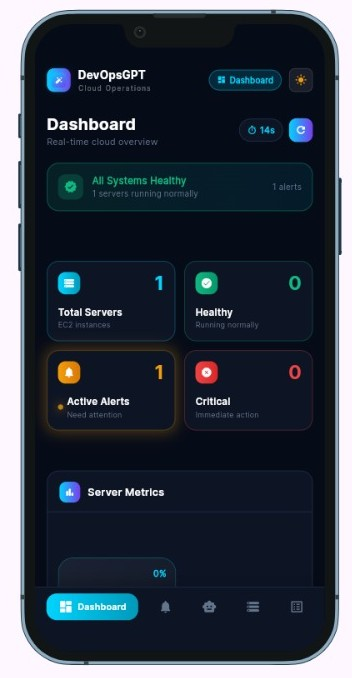
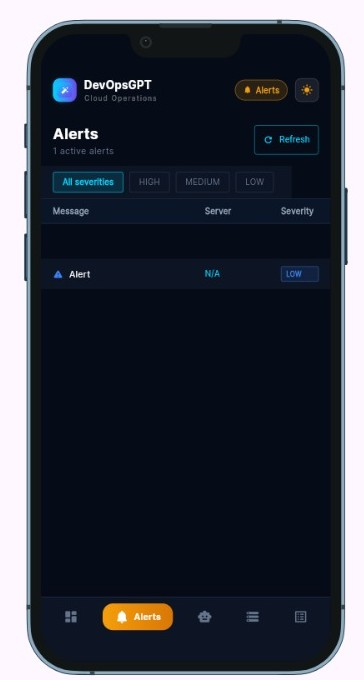
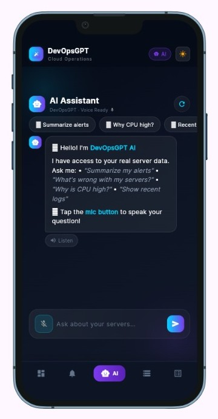
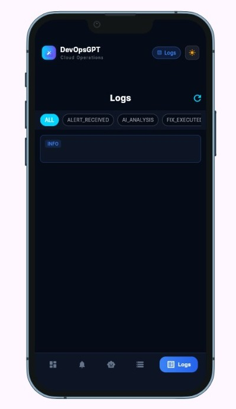
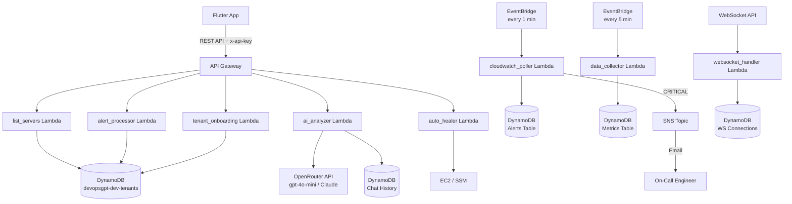

# DevOpsGPT — AI-Powered Cloud Operations Platform


DevOpsGPT is a multi-tenant SaaS platform that monitors AWS infrastructure in real time, uses AI to diagnose incidents, and executes automated fixes — all from a Flutter mobile app. It eliminates the need for engineers to manually triage CloudWatch alarms by providing instant root cause analysis and one-tap remediation.

---

## Screenshots

| Dashboard | Alerts | AI Assistant | Logs |
|:---------:|:------:|:------------:|:----:|
|  |  |  |  |

> Real-time EC2 monitoring · Severity-filtered alerts · Voice-enabled AI chat · CloudWatch log viewer

---

## Architecture



---

## Prerequisites

| Tool | Version | Install |
|------|---------|---------|
| Flutter SDK | 3.x | [flutter.dev](https://flutter.dev/docs/get-started/install) |
| Dart SDK | 3.x | Included with Flutter |
| AWS CLI | v2 | [aws.amazon.com/cli](https://aws.amazon.com/cli/) |
| Terraform | 1.5+ | [terraform.io](https://www.terraform.io/downloads) |
| Python | 3.11 | [python.org](https://www.python.org/downloads/) |

---

## Setup

### 1. Clone and install Flutter dependencies

```bash
git clone https://github.com/sayan565/devopsGPT.git
cd devopsGPT/frontend
flutter pub get
```

### 2. Configure environment variables

```bash
cp .env.example .env
# Edit .env and fill in your values
```

### 3. Deploy infrastructure with Terraform

```bash
cd infrastructure/terraform
terraform init
terraform plan
terraform apply
```

### 4. Deploy Lambda functions

```bash
# Deploy all Lambda functions
cd backend/lambdas

for fn in list_servers alert_processor ai_analyzer fix_executor tenant_onboarding cloudwatch_poller data_collector; do
  cd $fn
  pip install -r requirements.txt -t . 2>/dev/null || true
  zip -r ${fn}.zip .
  aws lambda update-function-code \
    --function-name devopsgpt-dev-${fn//_/-} \
    --zip-file fileb://${fn}.zip \
    --region us-east-1
  cd ..
done
```

### 5. Run the Flutter app

```bash
cd frontend
flutter run \
  --dart-define=API_KEY=your_api_key_here \
  --dart-define=API_BASE_URL=https://your-api-id.execute-api.us-east-1.amazonaws.com/dev \
  --dart-define=WS_URL=wss://your-ws-id.execute-api.us-east-1.amazonaws.com/dev
```

---

## Environment Variables

| Variable | Required | Description |
|----------|----------|-------------|
| `API_KEY` | ✅ | AWS API Gateway x-api-key |
| `API_BASE_URL` | ✅ | API Gateway base URL |
| `WS_URL` | ❌ | WebSocket API URL (disabled by default) |
| `FIREBASE_API_KEY` | ✅ | Firebase project API key |
| `OPENROUTER_API_KEY` | ✅ | OpenRouter API key — set on Lambda env var |
| `OPENROUTER_MODEL` | ❌ | AI model (default: `openai/gpt-4o-mini`) |

---

## API Endpoints

| Method | Path | Description | Lambda |
|--------|------|-------------|--------|
| `GET` | `/servers` | List EC2 instances for tenant | `list_servers` |
| `GET` | `/alerts` | List CloudWatch alarms | `alert_processor` |
| `GET` | `/logs` | Fetch CloudWatch log events | `metrics_streamer` |
| `POST` | `/ai-chat` | Send message to AI assistant | `ai_analyzer` |
| `POST` | `/fix` | Trigger automated fix | `auto_healer` |
| `POST` | `/tenants` | Register new tenant | `tenant_onboarding` |
| `GET` | `/tenants-lookup` | Look up tenant by email | `tenant_lookup` |
| `POST` | `/ai-analysis` | Deep AI root cause analysis | `ai_analysis` |
| `POST` | `/fix-execute` | Execute specific fix type | `fix_executor` |

---

## Running Tests

### Flutter tests

```bash
cd frontend
flutter test                    # all tests
flutter test --coverage         # with coverage report
flutter test test/services/     # service tests only
flutter test test/widgets/      # widget tests only
```

### Python backend tests

```bash
# Install test dependencies
pip install pytest pytest-cov boto3 moto

# Run all backend tests
pytest backend/ -v --cov=backend/lambdas --cov-report=term-missing

# Run specific Lambda tests
pytest backend/lambdas/cloudwatch_poller/test_handler.py -v
pytest backend/lambdas/ai_analysis/test_handler.py -v
```

---

## CI/CD

Three GitHub Actions workflows run automatically:

| Workflow | Trigger | Jobs |
|----------|---------|------|
| [`ci.yml`](.github/workflows/ci.yml) | Push/PR to `main`, `develop` | Flutter lint, test, build · Backend lint, test |
| [`deploy-backend.yml`](.github/workflows/deploy-backend.yml) | Push to `main` | Terraform apply · Lambda deploy · Smoke tests |
| [`deploy-flutter.yml`](.github/workflows/deploy-flutter.yml) | Push to `main` | Build signed APK · Firebase App Distribution |

### Required GitHub Secrets

| Secret | Used by |
|--------|---------|
| `AWS_ACCESS_KEY_ID` | All workflows |
| `AWS_SECRET_ACCESS_KEY` | All workflows |
| `API_KEY` | CI build, smoke tests |
| `API_BASE_URL` | CI build, smoke tests |
| `TF_STATE_BUCKET` | deploy-backend |
| `KEYSTORE_FILE` | deploy-flutter (base64 encoded) |
| `KEY_ALIAS` | deploy-flutter |
| `KEY_PASSWORD` | deploy-flutter |
| `FIREBASE_APP_ID` | deploy-flutter |
| `FIREBASE_TOKEN` | deploy-flutter |
| `CODECOV_TOKEN` | ci |

---

## Architecture Decisions

### WebSocket Disabled
WebSocket real-time streaming is implemented in `frontend/lib/services/websocket_service.dart` but disabled via `WEBSOCKET_ENABLED = false`. The feature is out of scope for the MVP release and retained as the foundation for **FS3** in the roadmap. The app falls back to REST polling (30-second interval) for metric updates. See [FUTURE_ROADMAP.md](FUTURE_ROADMAP.md#fs3--real-time-websocket-streaming).

### Multi-Tenant Architecture
Each tenant has an IAM role in their own AWS account. DevOpsGPT assumes this role via STS `AssumeRole` with an `ExternalId` (the tenant UUID) for security. The role ARN is stored in DynamoDB and looked up per request — no hardcoded credentials.

### AI Provider
The AI chat uses **OpenRouter API** (currently `gpt-4o-mini`, configurable via `OPENROUTER_MODEL` env var) for all conversational queries and root cause analysis. OpenRouter provides model flexibility — the model can be switched to Claude, Llama, or any other supported model without code changes. The `OPENROUTER_API_KEY` is injected via Lambda environment variable.

---

## Future Roadmap

See [FUTURE_ROADMAP.md](FUTURE_ROADMAP.md) for the full 6-item roadmap including:
- FS1: Predictive AI Failure Analysis (CloudWatch Anomaly Detection)
- FS2: Auto-Healing Confidence Scoring
- FS3: Extended WebSocket Timeseries Streaming
- FS4: Multi-Cloud Support (GCP, Azure)
- FS5: Role-Based Access Control
- FS6: AI Conversation Memory (partially delivered)

---

## License

MIT — see [LICENSE](LICENSE)
